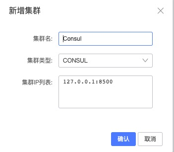
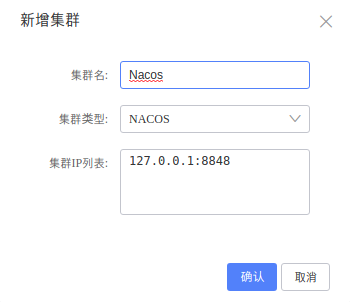
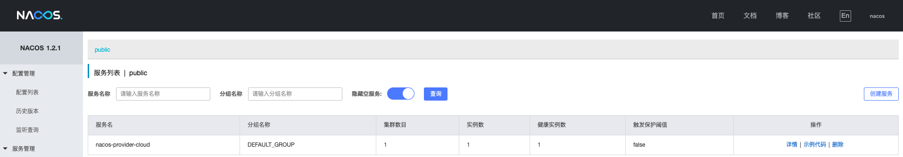
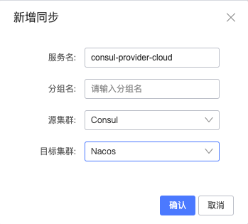
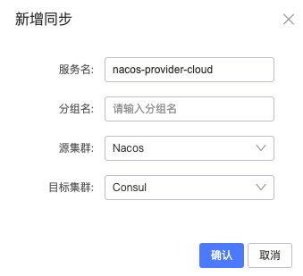
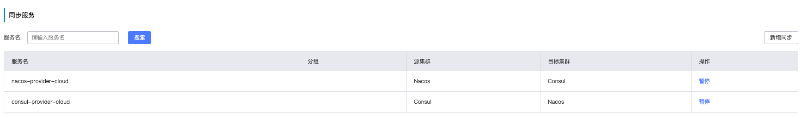
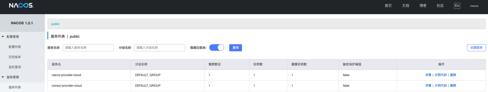
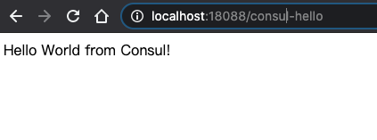
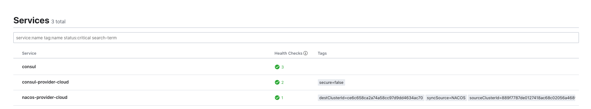

# Nacos Sync 双向同步 使用


## 环境准备

本例子包含Cloud两种注册中心互相同步演示

1. Cloud Consul 同步 Nacos
2. Cloud Nacos 同步 Consul

| 服务       | 版本  |
| ---------- | ----- |
| Consul  | 1.7.3 |
| Nacos      | 1.2.1 |
| Mysql      | 5.7   |
| Nacos-Sync | 0.3.7 |


本文演示上面的中间件服务均使用的是Docker Image,下面是docker安装过程

1. Consul 启动,这里启动4个Consul Agent，3个Server（会选举出一个leader）,1个Client.

```shell
#启动第1个Server节点，集群要求要有3个Server，将容器8500端口映射到主机8900端口，同时开启管理界面
docker run -d --name=consul1 -p 8900:8500 -e CONSUL_BIND_INTERFACE=eth0 consul agent --server=true --bootstrap-expect=3 --client=0.0.0.0 -ui

#查看启动后的第一个consul 容器IP
docker exec -it consul1 cat /etc/hosts | grep 172 

#启动第2个Server节点，并加入集群
docker run -d --name=consul2 -e CONSUL_BIND_INTERFACE=eth0 consul agent --server=true --client=0.0.0.0 --join 第一个容器ip
 
#启动第3个Server节点，并加入集群
docker run -d --name=consul3 -e CONSUL_BIND_INTERFACE=eth0 consul agent --server=true --client=0.0.0.0 --join 第一个容器ip
 
#启动第4个Client节点，并加入集群
docker run -d --name=consul4 -e CONSUL_BIND_INTERFACE=eth0 consul agent --server=false --client=0.0.0.0 --join 第一个容器ip
```


2. 启动Nacos server

```powershell
$ docker run --name nacos-standalone -e MODE=standalone -p 8848:8848 -d nacos/nacos-server:2.0.1
```


3. 启动Mysql

```powershell
$ docker run --name nacos-sync-db -e MYSQL_ROOT_PASSWORD=root -e MYSQL_DATABASE=nacos_sync -p 3306:3306 -d  mysql:5.7
```


4. 启动Nacos-Sync

   下载最新Nacos-Sync Release包,并解压,进入解压后的目录,并修改conf/application.properties中的mysql配置

   ```properties
   server.port=8081
   server.servlet.context-path=/
   
   spring.jpa.properties.hibernate.dialect=org.hibernate.dialect.MySQL5Dialect
   spring.jpa.hibernate.ddl-auto=update
   
   
   spring.datasource.url=jdbc:mysql://127.0.0.1:3306/nacos_sync?characterEncoding=utf8
   spring.datasource.username=root
   spring.datasource.password=root
   ```

   

   执行启动脚本

   ```powershell
   $ ./bin/startup.sh restart
   ```

   


## Nacos Sync 添加集群

打开Nacos Sync: localhost:8081

### 添加Zookeeper集群

1. 选择 集群配置->新增集群



### 添加Nacos集群

1. 选择 集群配置->新增集群

   

   

### 添加完成效果


## 演示

创建两个Spring Cloud 应用分别向Consul和Nacos注册服务,并且通过上面的Nacos Sync完成Consul和Nacos注册中心服务的相互同步.下面贴出一些关键代码,具体代码请参考[nacos-sync-example](https://github.com/paderlol/nacos-sync-exam)


### 通过Consul注册Spring Cloud服务

#### 创建一个Controller服务

下面的Controller中, `/hello`是注册在Consul的restful服务,`/nacos-hello` 是引用的在Nacos注册的服务

``` java
@RestController
public class HelloController {

    @GetMapping(value = "/hello")
    public String hello() {

        return "Hello World from Consul!";
    }

    @Autowired
    private HelloService helloService;
		// 注册在Nacos注册中心的服务
    @GetMapping(value = "/nacos-hello")
    public String hello2() {
        return helloService.hello();
    }

}
```


#### 启动consul-provider-cloud应用

运行 consul-provider-cloud工程下面com.paderlol.nacos.consul.ConsulProviderApplication类, 应用端口为18089

```java
@SpringBootApplication
@EnableFeignClients
public class ConsulProviderApplication {

    public static void main(String[] args) {
        SpringApplication.run(ConsulProviderApplication.class, args);
    }

  // 引用Nacos同步过来的服务
    @FeignClient(name = "nacos-provider-cloud")
    public interface HelloService {
        @RequestMapping(value = "/hello", method = RequestMethod.GET)
        String hello();


    }
}
```


####  验证注册

1. 可以看到我们的服务已经在Consul注册成功了


2. 在浏览器输入: http://localhost:18089/hello 可以看到页面返回**Hello World from Consul!**


### 通过Nacos注册Spring Cloud服务


#### 创建一个Controller服务

下面的Controller中, `/hello`是Nacos本身的restful服务,`/consul-hello` 是引用的在Consul注册的服务

```java
@RestController
public class HelloController {

    @Autowired
    private HelloService helloService;

    @GetMapping(value = "/consul-hello")
    public String hello() {
        return helloService.hello();
    }


    @GetMapping(value = "/hello")
    public String hello2() {
        return "Hello World from Nacos!";
    }

}
```


#### 启动nacos-provider-cloud应用

运行 nacos-provider-cloud工程下面com.example.NacosCloudConsulConsumerApplication类, 应用端口为18088

```java
@SpringBootApplication
@EnableDiscoveryClient
@EnableFeignClients
public class NacosCloudConsulConsumerApplication {

    public static void main(String[] args) {
        SpringApplication.run(NacosCloudConsulConsumerApplication.class, args);
    }


    @FeignClient(name = "consul-provider-cloud")
    public interface HelloService {
        @RequestMapping(value = "/hello", method = RequestMethod.GET)
        String hello();


    }
}
```


 ####  验证注册

1. 可以看到我们的服务已经在Nacos注册成功了



2. 在浏览器输入: http://localhost:18088/hello 可以看到页面返回**Hello World from Nacos!**


### 添加同步任务

1. 打开Nacos-Sync 控制台,添加同步任务。

   选择 服务同步 -> 新增同步, 如图

   

   

   

3. 添加完成效果




### 打开Nacos 控制台 查看同步结果

打开Nacos 控制台: http://localhost:8848/nacos

选择 服务管理-> 服务列表 ,如图





打开浏览器: http://localhost:18088/consul-hello  如图




### 打开Consul 控制台 查看同步结果

打开Consul 控制台: http://localhost:8900/ui/dc1/services





打开浏览器: http://localhost:18089/nacos-hello  如图


## 总结

从上面的演示中,我们可以看到Nacos-Sync已经可以支持Nacos和Consul的Spring Cloud应用的双向同步,可以很好的在Spring Cloud中支持Consul平滑迁移到Nacos应用.

稍微美中不足的暂时还没支持一键批量迁移,现在的服务同步,基本都需要建立一个服务维度的服务,后面陆续也会支持,也欢迎社区的小伙伴一起参与共建.


