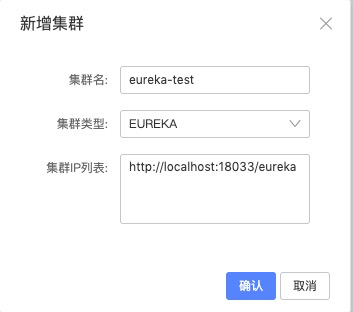
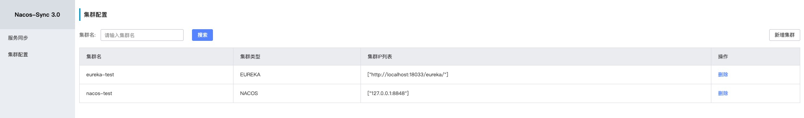
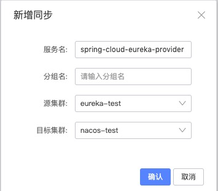

# Nacos Sync 单向同步 使用


> 本例子演示Eureka单向同步到Nacos
>


## 环境准备

| 服务       | 版本      |
| ---------- | --------- |
| Nacos      | 1.0.0-RC3 |
| Mysql      | 5.7       |
| Nacos-Sync | 0.2.0     |

本文演示上面的中间件服务均使用的是Docker Image,下面是docker安装过程


1. 启动Nacos server

```powershell
$ docker run --name nacos-standalone -e MODE=standalone -p 8848:8848 -d nacos/nacos-server:1.0.0-RC3
```


2. Eureka Server & Eureka Provider 启动

```java
// 启动 Eureka Server
@SpringBootApplication
@EnableEurekaServer
public class EurekaServerApplication {

    public static void main(String[] args) {
        SpringApplication.run(EurekaServerApplication.class, args);
    }

}
```


```java
//启动 Eureka Provider
@SpringBootApplication
public class EurekaProviderApplication {

    public static void main(String[] args) {
        SpringApplication.run(EurekaProviderApplication.class, args);
    }

}
```


3. 启动Mysql

```powershell
$ docker run --name nacos-sync-db -e MYSQL_ROOT_PASSWORD=root -e MYSQL_DATABASE=nacos_sync -p 3306:3306 -d  mysql:5.6
```


4. 启动Nacos-Sync

下载最新Nacos-Sync Release包,并解压,进入解压后的目录,并修改conf/application.properties中的mysql配置

```properties
server.port=8081
server.servlet.context-path=/

spring.jpa.properties.hibernate.dialect=org.hibernate.dialect.MySQL5Dialect
spring.jpa.hibernate.ddl-auto=update


spring.datasource.url=jdbc:mysql://127.0.0.1:3306/nacos_sync?characterEncoding=utf8
spring.datasource.username=root
spring.datasource.password=root
```


执行启动脚本

```powershell
$ ./bin/startup.sh restart
```


## Nacos Sync 添加集群

打开Nacos Sync: localhost:8081

### 添加Eureka集群

1. 选择 集群配置->新增集群



## 添加Nacos集群

1. 选择 集群配置->新增集群

   

   

## 添加完成效果




## Eureka 同步 Nacos


### 添加同步任务

1. 打开Nacos-Sync 控制台,添加同步任务。

   选择 服务同步 -> 新增同步, 如图

   

2. 添加完成效果


### 打开Nacos 控制台 查看同步结果

打开Nacos 控制台: http://localhost:8848/nacos

选择 服务管理-> 服务列表 ,如图


### 测试：通过Nacos注册中心进行服务调用

运行 nacos-consumer工程中的com.paderlol.nacos.consumer.NacosConsumerApplication类

```java
@SpringBootApplication
@EnableDiscoveryClient
@EnableFeignClients
public class NacosConsumerApplication {

    public static void main(String[] args) {
        SpringApplication.run(NacosConsumerApplication.class, args);
    }

    @FeignClient(name = "spring-cloud-eureka-provider")
    public interface HelloService {
        @RequestMapping(value = "/hello", method = RequestMethod.GET)
        String hello();


    }
}
```


打开浏览器:<http://localhost:18034/nacos-hello>

