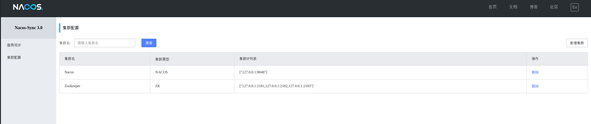
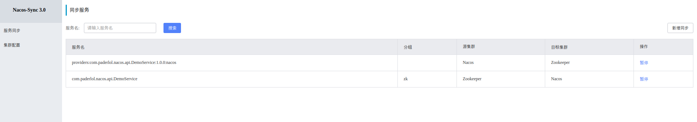

# Nacos Sync 双向同步 使用


> 本例子包含Dubbo两种注册中心互相同步演示
>
> 1. Dubbo Zookeeper 同步 Nacos
> 2. Dubbo Nacos 同步 Zookeeper


## 环境准备

| 服务       | 版本  |
| ---------- | ----- |
| Zookeeper  | 3.4.9 |
| Nacos      | 1.0.0-RC3 |
| Mysql      | 5.7   |
| Nacos-Sync | 0.3.0 |

本文演示上面的中间件服务均使用的是Docker Image,下面是docker安装过程

1. Zookeeper 启动

```shell
$ docker-compose -f zookeeper.yaml up -d
```


这是上面脚本中的yaml文件内容：

```yaml
version: '3.1'

services:
  zoo1:
    image: zookeeper:3.4.9
    restart: always
    hostname: zoo1
    ports:
      - 2181:2181
    environment:
      ZOO_MY_ID: 1
      ZOO_SERVERS: server.1=0.0.0.0:2888:3888 server.2=zoo2:2888:3888 server.3=zoo3:2888:3888

  zoo2:
    image: zookeeper:3.4.9
    restart: always
    hostname: zoo2
    ports:
      - 2182:2181
    environment:
      ZOO_MY_ID: 2
      ZOO_SERVERS: server.1=zoo1:2888:3888 server.2=0.0.0.0:2888:3888 server.3=zoo3:2888:3888

  zoo3:
    image: zookeeper:3.4.9
    restart: always
    hostname: zoo3
    ports:
      - 2183:2181
    environment:
      ZOO_MY_ID: 3
      ZOO_SERVERS: server.1=zoo1:2888:3888 server.2=zoo2:2888:3888 server.3=0.0.0.0:2888:3888
```


2. 启动Nacos server

```powershell
$ docker run --name nacos-standalone -e MODE=standalone -p 8848:8848 -d nacos/nacos-server:1.0.0-RC3
```


3. 启动Mysql

```powershell
$ docker run --name nacos-sync-db -e MYSQL_ROOT_PASSWORD=root -e MYSQL_DATABASE=nacos_sync -p 3306:3306 -d  mysql:5.7
```


4. 启动Nacos-Sync

   下载最新Nacos-Sync Release包,并解压,进入解压后的目录,并修改conf/application.properties中的mysql配置

   ```properties
   server.port=8081
   server.servlet.context-path=/
   
   spring.jpa.properties.hibernate.dialect=org.hibernate.dialect.MySQL5Dialect
   spring.jpa.hibernate.ddl-auto=update
   
   
   spring.datasource.url=jdbc:mysql://127.0.0.1:3306/nacos_sync?characterEncoding=utf8
   spring.datasource.username=root
   spring.datasource.password=root
   ```

   

   执行启动脚本

   ```powershell
   $ ./bin/startup.sh restart
   ```

   


## Nacos Sync 添加集群

打开Nacos Sync: localhost:8081

### 添加Zookeeper集群

1. 选择 集群配置->新增集群


## 添加Nacos集群

1. 选择 集群配置->新增集群

   

   

## 添加完成效果




## Zookeeper 同步 Nacos

### 通过ZK注册Dubbo服务

运行 zookeeper-provider工程com.paderlol.nacos.provider.ZookeeperProviderApplication

```java
@SpringBootApplication
@Slf4j
@EnableDubbo
public class ZookeeperProviderApplication {


    public static void main(String[] args) {
        SpringApplication.run(ZookeeperProviderApplication.class);
    }


}
```


### 添加同步任务

1. zookeeper-provider 注册的服务

   服务名： com.paderlol.nacos.api.DemoService

   版本号：1.0.0

   分组：zk

2. 打开Nacos-Sync 控制台,添加同步任务。

   选择 服务同步 -> 新增同步, 如图

   

3. 添加完成效果



### 打开Nacos 控制台 查看同步结果

打开Nacos 控制台: http://localhost:8848/nacos

选择 服务管理-> 服务列表 ,如图


### 测试：通过Nacos注册中心进行服务调用

运行 nacos-consumer工程中的com.paderlol.nacos.consumer.NacosConsumerApplication类

```java
@SpringBootApplication
@Slf4j
public class NacosConsumerApplication implements ApplicationRunner {

    @Reference(version = "${demo.service.version}",group = "${demo.service.group}")
    private DemoService zookeeperDemoService;

    public static void main(String[] args) {
        SpringApplication.run(NacosConsumerApplication.class).close();
    }

    public void run(ApplicationArguments args) throws Exception {
        log.info(zookeeperDemoService.sayHello("This is from Zookeeper to Nacos Sync !"));
    }
}
```


可以看到日志中打印出 服务提供方的应用名称 以及我们发送的消息.

```powershell
2019-01-17 18:25:07.115  INFO 16228 --- [           main] c.p.n.consumer.NacosConsumerApplication  : [zookeeper-provider] : Hello, This is from Zookeeper to Nacos Sync !
```


## Nacos 同步 Zookeeper

### 通过Naco注册Dubbo服务

启动 nacos-provider工程中的 `com.paderlol.nacos.provider.NacosProviderApplication`  类

```java
@SpringBootApplication
@Slf4j
@EnableDubbo
public class NacosProviderApplication {


    public static void main(String[] args) {
        SpringApplication.run(NacosProviderApplication.class);
    }


}
```


### 添加同步任务

1. 打开Nacos 控制台查看刚才注册的服务,并且复制服务名,如图

   

2. 打开Nacos-Sync 控制台,添加同步任务。

   选择 服务同步 -> 新增同步, 如图

​        

**注意**：通过Nacos注册的Dubbo服务不需要填写**分组**,因为服务名里面已经包括**分组**和**版本信息**


3. 添加完成效果


### 测试：通过ZK调用刚才同步的任务

运行 zookeeper-consumer 工程中的 `com.paderlol.nacos.consumer.ZookeeperConsumerApplication` 类

```java
@SpringBootApplication
@Slf4j
public class ZookeeperConsumerApplication implements ApplicationRunner {

    @Reference(version = "${demo.service.version}",group = "${demo.service.group}")
    private DemoService nacosDemoService;

    public static void main(String[] args) {
        SpringApplication.run(ZookeeperConsumerApplication.class).close();
    }

    public void run(ApplicationArguments args) throws Exception {
        log.info(nacosDemoService.sayHello("This is from Nacos to Zookeeper Sync !"));
    }
}
```

可以看到日志中打印出 服务提供方的应用名称 以及我们发送的消息.

```powershell
2019-01-17 18:40:31.593  INFO 17728 --- [           main] c.p.n.c.ZookeeperConsumerApplication     : [nacos-provider] : Hello, This is from Nacos to Zookeeper Sync !
```

